# Milestone 3: Virtual Memorial and Tribute Space

<figure>
    
</figure>


## In Loving Memory - Virtual Memorial & Tribute Space

### Project Overview & Context

This web application has been developed for Milestone 3 of the Code Institute Level 5 Diploma in Web Application Development. The brief was to develop and implement a responsve, full-stack, database-back web application using Python, Django framework and a relational database. 

I have created a private virtual memorial and tribute space dedicated to the memory of my late father. It provides an interface where family, friends and community can easily read a shared timeline of condolences, submit their own text-based tributes and light a virtual candle.


You can view the deployed application here [Laurie Irvine Memorial](https://web-production-721e.up.railway.app/)


---

## CONTENTS

* [User Experience](#user-experience-ux)
  * [User Stories](#user-stories)

* [Design](#design)
  * [Colour Scheme](#colour-scheme)
  * [Typography](#typography)
  * [Imagery](#imagery)
  * [Wireframes](#wireframes)

* [Features](#features)
  * [General Features on Each Page](#general-features-on-each-page)
  * [Future Implementations](#future-implementations)
  * [Accessibility](#accessibility)

* [Technologies Used](#technologies-used)
  * [Languages Used](#languages-used)
  * [Frameworks, Libraries & Programs Used](#frameworks-libraries--programs-used)

* [Deployment & Local Development](#deployment--local-development)
  * [Deployment](#deployment)
  * [Local Development](#local-development)
    * [How to Fork](#how-to-fork)
    * [How to Clone](#how-to-clone)

* [Testing](#testing)
  * [Solved Bugs](#solved-bugs)
  * [Known Bugs](#known-bugs)


* [Credits](#credits)
  * [Code Used](#code-used)
  * [Content](#content)
  * [Media](#media)
  * [Acknowledgments](#acknowledgments)

---

## User Experience (UX)

### Target Audience
Family members, friends, neighbours, colleagues wishing to share condolences and memories or light a virtual candle.

### User Stories

#### First Time Visitor goals
* As a First Time Visitor, I want to see a clean timeline of tributes and memories left by others without having to navigate a complicated website layout.

* As a First Time Visitor, I want to easily find and fill out a simple guestbook form with my name, relationship and a personal memory without being forced to create an account.

* As a First Time Visitor, I want to light a virtual candle alongside my message so that I can show my support


#### Returning Visitor goals
* As a Returning Visitor, I want to revisit the page and see an updated total counter of how many virtual candles have been lit, so that I can see the ongoing support from friends and family over time.

* As a Returning Visitor, I want to search for a specific tribute by a particular person, or a keyword so that I can read the story and share others memories.

* As a Returning Visitor, who has already left a memory, I want to ensure that nobody else can accidentally edit or delete it from the front end. 

## Design


### Colour Scheme

This is a deeply personal project paying tribute to my dad who was a massive Chelsea FC fan. I decided from the start that I wanted to include the colours from the Chelsea FC logo into the design. This included Blue, White and Gold. 
<br>
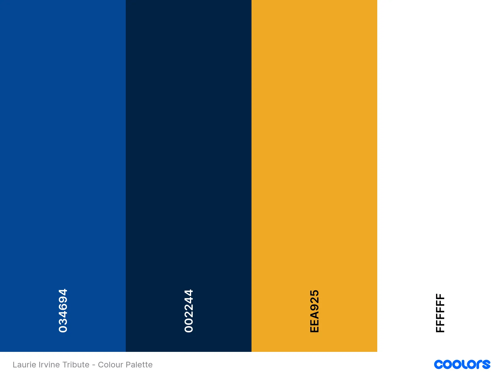

<br>
<br>
<br>
<br>
<br>
<br>
<br>
<br>
<br>
<br>
I used [coolors](https://coolors.co/) to create my colour palette.
These colours have been used in the following way:
* I have used `#034694` as the button backgrounds and the card accent colours.
* I have used `#034694` as the text colour and the header / footer colours.
* I have used `#eea925` as accents between sections and the text for the footer. `
* I have used `#fff` for the header text, to stand out against the blue background, the background for the candles lit count.

For this project I used CSS styles for colours throughout the project. Instead of hard-coding hex codes in the various styles I declared the colour palette as global variables in the `root:` selector. This made sense for many reasons, primarily because the colours need only be declared once. Any follow up changes or tweaks to colours can be made in one place and updated throughout.

By using `var` to insert the value of a variable it also means I can give them semantic meaning. So instead of a variety of different Hex code, I instead have `var(--accent-colour)` which is brilliant for readability throughout.  
 

### Typography

I used [Google Fonts](https://fonts.google.com/) for this project. 

* For headings / titles I used <strong>Oswald</strong>. I chose this font as I wanted a sans-serif clean looking font that was easy to read but still strong and stylish.

  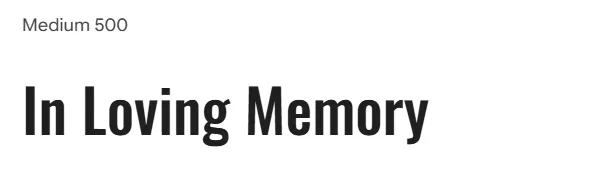
  <hr>
  <br>
* For the main body text, I wanted to include a sans serif font for readability so I used <strong>Inter</strong>. 

   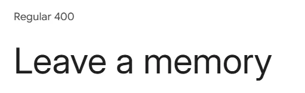

  <hr>
  <br>
* For the footer text, I wanted to include a calligraphy style font, so it read like we were leaving a signature at the bottom, but I didn't want anything to intricate that would be difficult to read, so I went with <strong>Alex Brush</strong>. 

   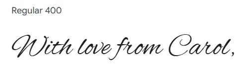

### Imagery

* Logo / Header - For the logo, I wanted a simple image of my dad at his favourite place, Stamford Bridge. I used a photo I had taken back in 2023 and used [Photopea](http://www.Photopea.com) to remove the background. 

   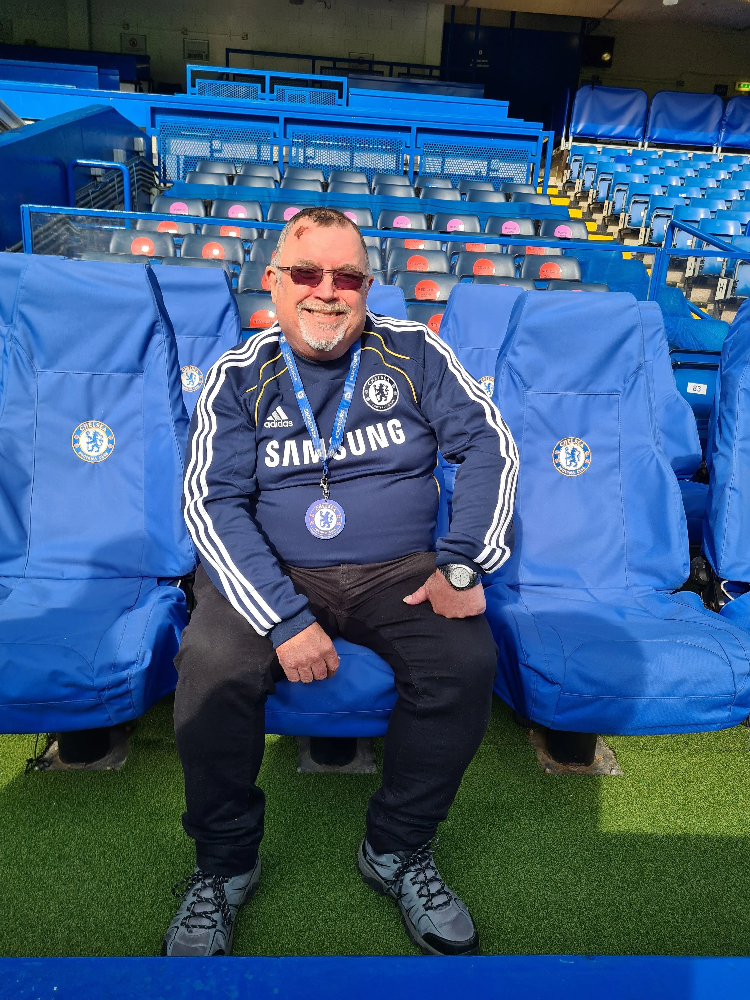  
   Before editing
   <br>
  
    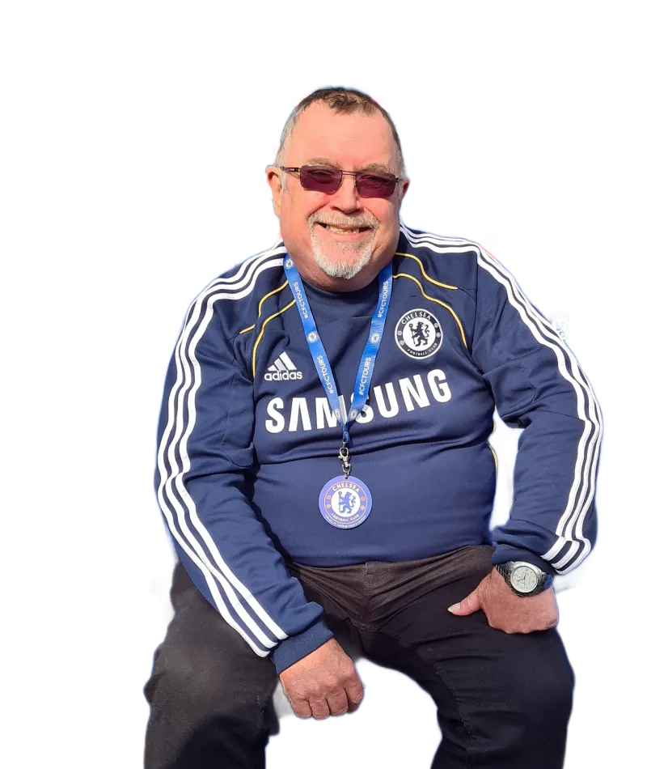  
    After editing
    <br>
<br>
<br>

* Emojis - For all of the other imagery on the website I have used the standard emojis:
  * Candle: 🕯️
  * Football: ⚽
  * Search: 🔍
  * Padlock: 🔒


### Wireframes
Wireframes were created using [Canva](https://www.canva.com)


#### Desktop
<figure>
    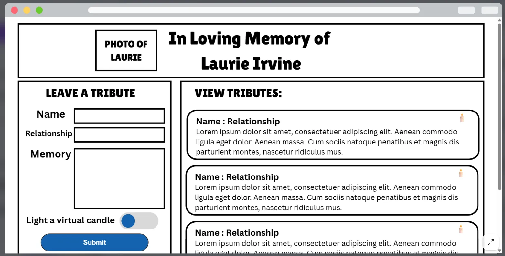
    <figcaption>This shows the view on page load - You will see the header with photo of Laurie, the left hand will contain the form to write the tribute, with the right hand side acting as a display of all tributes left.</figcaption>
</figure>
<figure>
    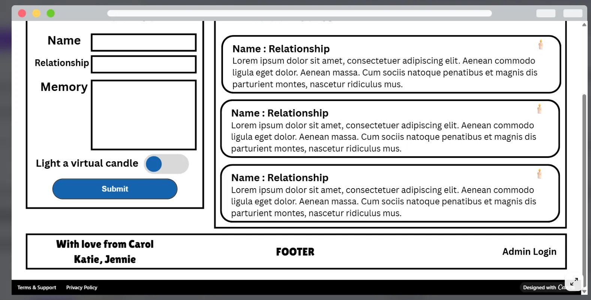
    <figcaption>This shows the view when scrolling to the bottom - The right hand side will continue to show the display of tributes left, with a bold footer at the bottom with a signature from the family and admin portal login for maintenance of the tributes left.</figcaption>
</figure>


#### Mobile
<figure>
    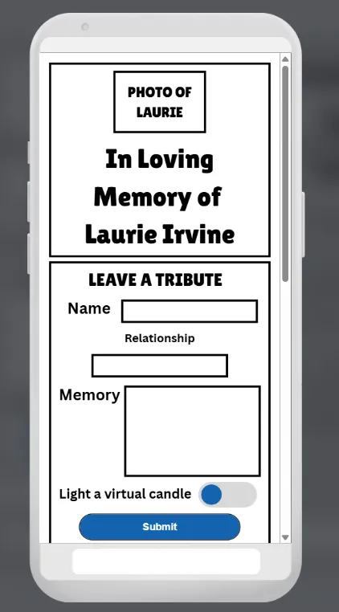
    <figcaption>This shows the view on mobile on page load. It's important that users can see whe the memorial is for and be presented with the form to leave a tribute clearly.</figcaption>
</figure>

<figure>
    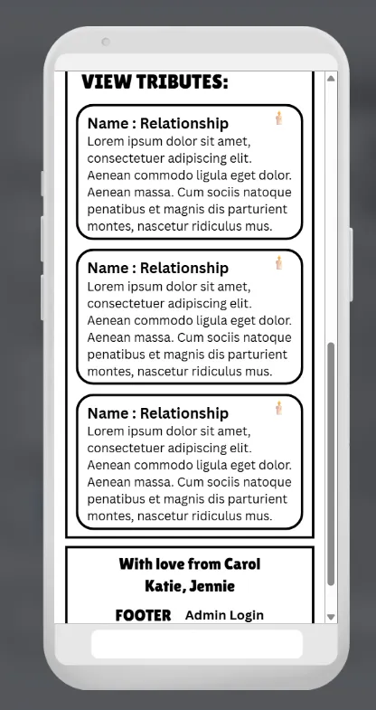
    <figcaption>This shows the view on mobile on page scroll. It shows all of the tributes left before reaching the footer at the bottom containing the family signature and admin login portal.</figcaption>
</figure>


## Features
The Virtual Memorial and Tribute space contains the following features:

* index.html - The primary view template which serves as both the tribute timeline feed and the form submission handling.
* /admin - The Django admin portal which allows registered users to edit and delete tributes as necessary.


### Favicon
The page has a a favicon of a candle image. This was chosen to make it obvious that the website was a memorial - as traditionally candles are used as a symbol.
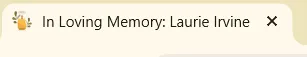


### Header
The page has a header section containing a cutout photo of Laurie Irvine against a textured background. The name of the tribute page is visualised in a bold font <strong>In loving memory of Laurie Irvine</strong> Below the text is a poem to remember Laurie. The last thing on the header is a count of the number of candles lit. 
<br>
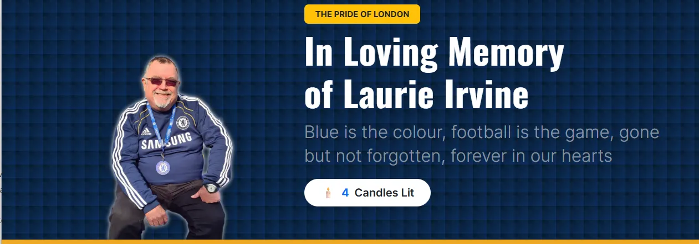

### Footer
The page has a simple footer section containing a gold signature of the family, followed by a link to the admin portal login. 


### Index.html
* The left hand grid (Using .col-4 flex) - Leave a Tribute form - This will allow users to leave a tribute and if they want to light a virtual candle in memory of Laurie Irvine.

<figure>
    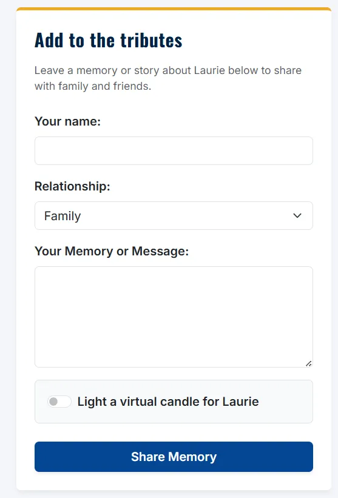
    <figcaption>This shows the section for adding a tribute on the desktop view</figcaption>
</figure>

* The right hand grid (Using .col-8 flex) - View the Tributes - This will allow users to scrol, search and view any tributes left. 
  * A search bar - to search for any particular keywords.
  * The name of the person who left the tribute
  * The relationship
  * Whether they lit a candle
  * The tribute content itself
  * The date/time the tribute was left

<figure>
  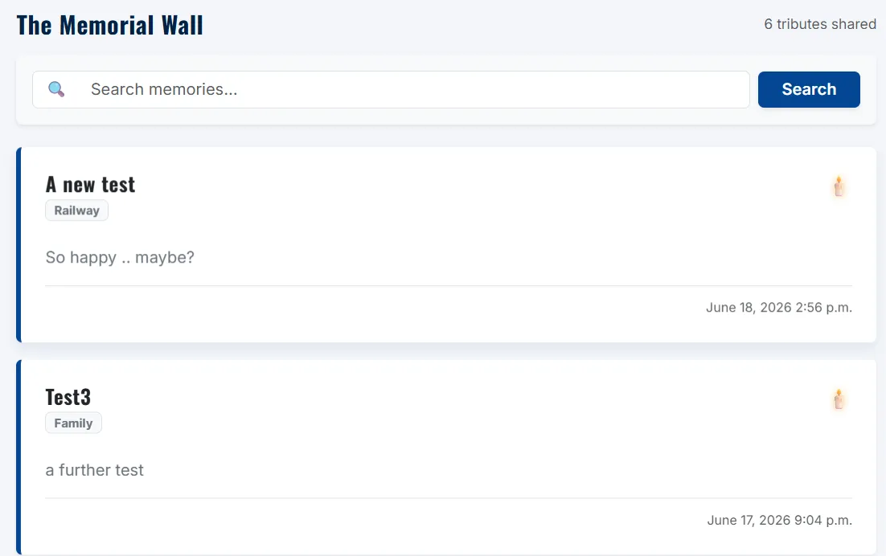
  <figcaption>This shows the section for searching and reading a tribute on the desktop view</figcaption>
</figure>

<br>
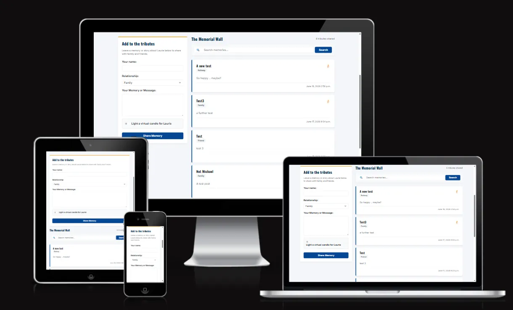
<br>


### /admin

The admin allow registered users to log into the Django admin panel to maintain the tributes left. 
<figure>
  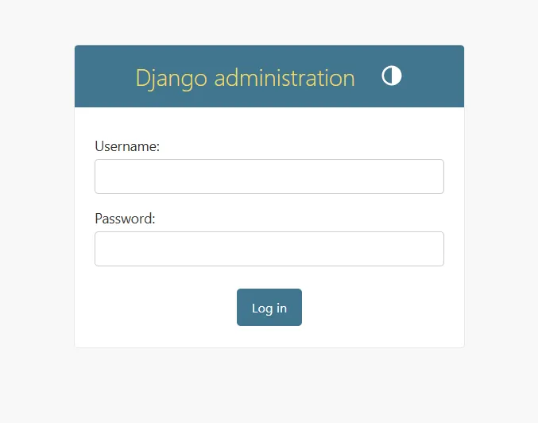
  <figcaption>This shows the view when a user arrives at the admin portal</figcaption>
</figure>
<br>
<figure>
  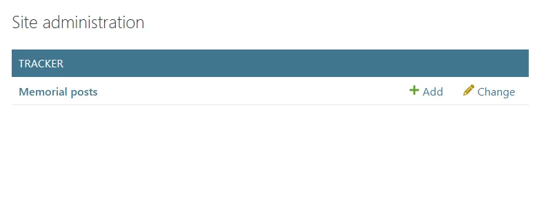
  <figcaption>This shows the view when a user successfully logs in to the admin portal</figcaption>
</figure>
<br>
<figure>
  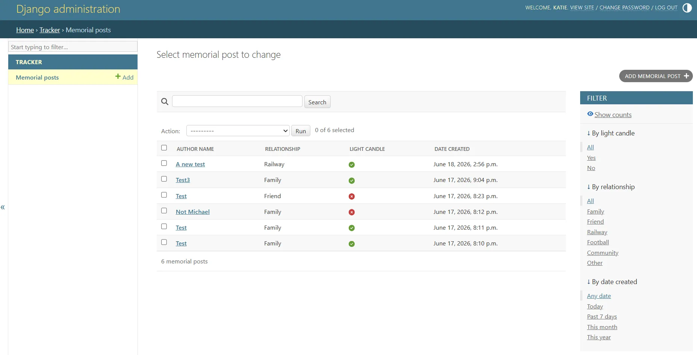
  <figcaption>This shows the view of all of the tributes currently left</figcaption>
</figure>
<br>
<figure>
  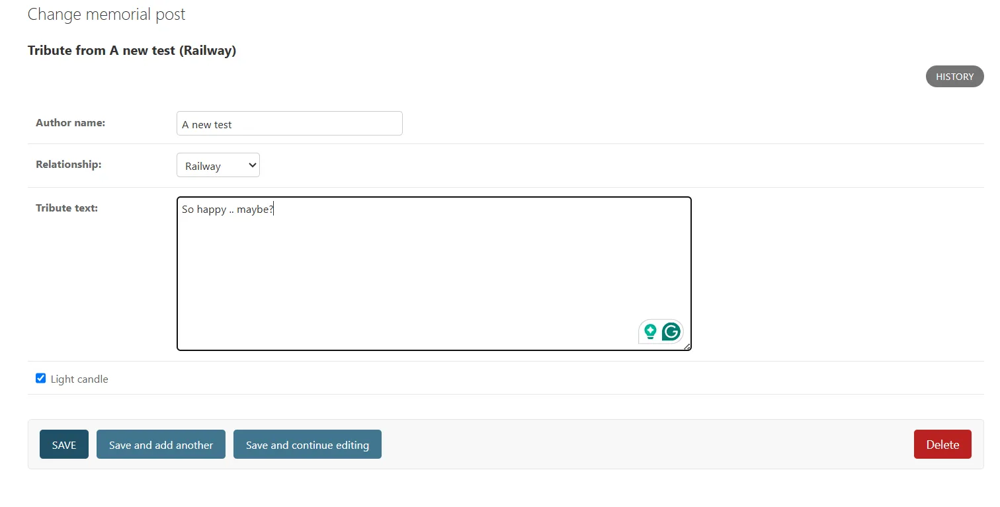
  <figcaption>This shows the view of how the admin can edit / delete a particular tribute.</figcaption>
</figure>

### Future Implementations

* I initially wanted to build the project with a light/dark mode toggle. As part of my research into this, I stumbled across using global variables for the colour scheme, which I have kept. I soon found myself getting sidetracked and spending a lot of time on the toggle and couldn't quite get it right, so decided to shelf it for this project and add it as a future development.


### Accessibility

Throughout this project I have aspired to make it as accessible as possible. 
#### Design
I deliberately chose a clean, high-contrast design throughout the project. The off white background colour is easier on the eye to the viewer. Using minimal colours throughout the project will aid players with visual impairments. 

The UI has been built using a mobile-first approach. It features large touch targets at all interaction points and a responsive header that scales to ensure that the gameplay content remains 'above the fold' on smaller screens. 

The game flow is designed with clear exit points 'Play Again' and 'Return to Menu' as well as the header providing a clickable link back to the homepage. Intuitive feedback is given to the player such as the distance calculations and score summaries. The aim is to ensure that players of all abilities can navigate the game with ease. 

### Coding
I have used semantic HTML and ARIA labels throughout to support those using assistive technologies and screen readers. This will be particularly helpful for the interactive elements, navigation and the modals. 

| Element      | ARIA Attribute | Purpose   |
| ----------- | ----------- | ----------- |
| Modals     | `role="dialog`       | Identifies the pop up as a separate interactive window      |
| Stats Cards   | `aria-live="polite`       | Automatically announces the score/round changes to visually impaired users       |
| Close Buttons   | `aria-label`        | Replaces the X symbol with clear close instructions        | 
| Game Map   | `role="application"`        | Signals that the map is an interactive tool rather than a static image       |           

## Technologies Used

* **Languages:** HTML5, CSS3, Python
* **Frameworks:** Django, Bootstrap 5
* **Database:** PostgreSQL
* **Hosting:** Heroku

### Libraries & Programs Used


* [Canva](https://www.canva.com/online-whiteboard/wireframes/) - Used to create wireframes.

* [Git](https://git-scm.com/) - For version control.

* [Github](https://github.com/) - To save and store the files for the website.

* [VS Code](https://code.visualstudio.com/) - IDE used to create the site.

* [Google Fonts](https://fonts.google.com/) - Google fonts were used to import the 'Orbitron' and the 'Roboto' font into the project.

* [To WebP](https://towebp.io/) - Used to convert images to WebP format.

* [Photopea](https://www.photopea.com/) - Used to edit and create graphics for the project

* [Favicon.io](https://favicon.io/) - Used to create the favicon based on the logo


## Deployment & Local Development


### Deployment

### GitHub Pages

The project was deployed to GitHub Pages using the following steps...

1. Log in to GitHub and locate the [GitHub Repository](https://github.com/)
2. At the top of the Repository (not top of page), locate the "Settings" Button on the menu.
3. Scroll down the Settings page until you locate the "GitHub Pages" Section.
4. Under "Source", click the dropdown called "None" and select "Master Branch".
5. The page will automatically refresh.
6. Scroll back down through the page to locate the now published site [link](https://github.com) in the "GitHub Pages" section.

### Forking the GitHub Repository

By forking the GitHub Repository we make a copy of the original repository on our GitHub account to view and/or make changes without affecting the original repository by using the following steps...

1. Log in to GitHub and locate the [GitHub Repository](https://github.com/)
2. At the top of the Repository (not top of page) just above the "Settings" Button on the menu, locate the "Fork" Button.
3. You should now have a copy of the original repository in your GitHub account.


## Testing
Please refer to [TESTING.md](TESTING.md) file for all testing carried out.

### Solved Bugs / Issues

| No | Feature | Issue | Fix |
| :--- | :--- | :--- | :--- |
| 1 | Tribute Wall | When adding a tribute, the entries nest rather than showing as indivdual entries.  | The for loop to display the entries was missing a closing div tag, which was causing the loop to not work correctly |
| 2| Header Section| After changing the initial header image, the image appeared to be floating, rather than lying flush against the gold border.  | I changed the flexbox grid ratio slightly to give the image more space and forced a zero margin / padding at the bottom of the image  |
| 3| Header Section| After making the changes for Bug 2, on inspection it appeared that the new grid spacing, made the image shrink significantly on tablet modes. Making the text larger, and the image insignificant.   | I decided to make use of Bootstraps responsive layout (col-md-6 , col-lg-5) to ensure the memorial image scales fluidly and sits flush against the gold border across all device viewports.   |
| 4| Deployment| The deployed application  on Railway was throwing a ``` FATAL: password authentication failed for user "postgres" ``` error on startup. | To begin with I checked that the database credentials matched the environment variables and used Railways password reset to force a resync/redeployment to check this wasn't the issue. After looking on the Railway forums for similar queries, I eventually realised it was the ``` dj_database_url ``` import that was causing the issue. I am still not entirely sure why it was causing the issue, i can only assume a character or similar was causing slicing issues when reading the string. After removing the ```dj_database_url ``` I resorted to using the Django DATABASES setting to explicitly read Railway's individual environment variables using ```os.environ.get() ``` which was in the official Railway Django deployment guide  |
| 5| Deployment| Once the application was functioning correctly, I turned the ``` DEBUG = True ``` to use a toggled format that keeps it True in development, but False once in production. ```DEBUG = os.environ.get('DEBUG_VALUE', 'True') == 'True'```. This threw up a new problem whereby Django wasn't picking up any of the images or styling, and would give a Server Error (500) with the Railway logs showing ```UserWarning: No directory at: /app/staticfiles/.``` | I spent some time looking at the Whitespace documentation (see link in credits). It turns out, that despite Whitenoise being configured correctly, Railway itself hadn't created the ```/app/staticfiles/``` directory inside the container. Therefore I needed to update the Start Command inside the Railway dashboard to tell it to execute Djangos asset compilation command BEFORE launching Gunicorn. This was achieved by updating the start command to ```python manage.py collectstatic --noinput && gunicorn your_project_name.wsgi```  |


## Credits

- [Deploying Django to Railway](https://www.youtube.com/watch?v=A4Pn2lEdoLQ&start=0): YouTube video by Coding Entrepreneurs to help with issues when deploying Django to Railway App.
- [Railway User Guides](https://docs.railway.com/guides/django): Railway official guides to support deploying Django app to Railway.
- [Whitespace with Django](https://whitenoise.readthedocs.io/en/stable/django.html): Used to help fix issue with styling / images not displaying on production app.


### Code Used
- [CSS3 Patterns Gallery](https://projects.verou.me/css3patterns/#carbon): Design by Atle Mo and code by Sebastien Grosjean. Modified for the blue header.


### Content

- [Doctor Who Locations](https://www.doctorwholocations.net/locations/list): Information about the Doctor Who filming locations

###  Media


- [https://shields.io/](https://shields.io/) - To create the badges on the README introduction
- [https://www.flaticon.com/free-icon/candle_2146319?term=candle&page=1&position=12&origin=search&related_id=2146319](https://flaticon.com) - Image of a candle used for the Favicon by JustIcon

  
###  Acknowledgments

