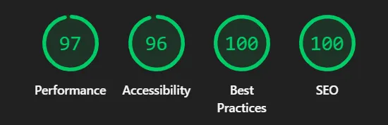
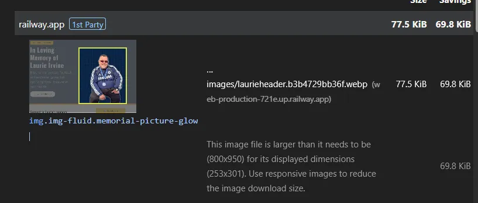
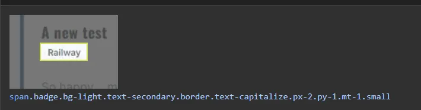
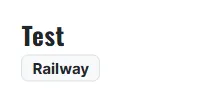
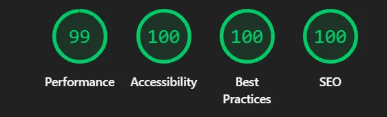
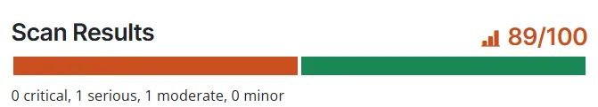
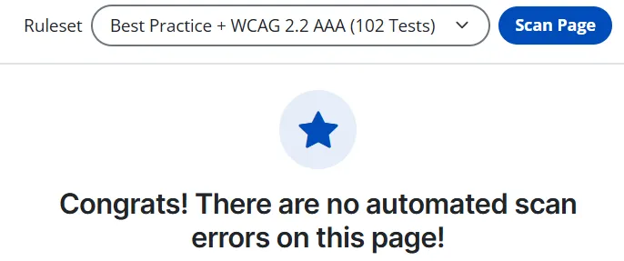

# Virtual Memorial and Tribute Space -  Testing

<figure>
    
</figure>

You can view the deployed application here [Laurie Irvine Memorial](https://web-production-721e.up.railway.app/)

- - -

## CONTENTS

* [AUTOMATED TESTING](#automated-testing)
  * [W3C Validator](#w3c-validator)
  * [Lighthouse](#lighthouse)
  * [Accessible Web](#accessile-web)
* [MANUAL TESTING](#manual-testing)
  * [Testing User Stories](#testing-user-stories)
  * [Full Testing](#full-testing)

Testing was ongoing throughout the entire build. I utilised Chrome developer tools whilst building to pinpoint and troubleshoot any issues as I went along.


- - -

## AUTOMATED TESTING

### Code Validation Profiles

**[W3C Validator](https://validator.w3.org/)** was used to validate the HTML on the website. 

* [index.html](https://validator.w3.org/nu/?level=warning&doc=https%3A%2F%2Fweb-production-721e.up.railway.app%2F) - Passed.

**[W3C Jigsaw CSS Validation Software](https://jigsaw.w3.org/css-validator/validator)** was used to validate the CSS on the website.
* index.html - Passed
        <p>
            <a href="https://jigsaw.w3.org/css-validator/check/referer">
                
            </a>
        </p>
<br>

**Python Code Quality Compliance** was used to test the python files in the application.
This was achieved as follows:
1. ````bash
    pip install flake8

2. ````bash
    flake8 tracker/

Flake8 will check against PEP8 guidelines to enforce clean styling, spacing conventions and prevent unexecuted code syntax blocks. As part of this testing I created a **.flake8** file. This was used to exclude any Boilerplate code and later on to exclude two E501 (line too long) errors from settings.py and models.py - these were excluded as there was no way to split the string across multiple lines. Other than the aforementioned errors - there were no further errors in the .py files.

- - -

### Lighthouse

I used Lighthouse within the Chrome Developer Tools to test the performance, accessibility, best practices and SEO of the website.


#### index.html

The initial result of the scan was 97 for Performance and 96 for Accessibility.
<figure>
    
</figure>

* **Performance Issues:** Bringing down this score were external libraries affecting the rendering time for the page load. The Bootstrap, Google Fonts and also the HTMX that is used on the Search were all included in this list. There is not a lot I can do myself to fix this, and shouldn't cause too much detriment to the performance.. One of the other issues was the size of the header image laurieheader.webp. 
<figure>
    
</figure>

To resolve the issue I opened the image back into Photopea and reduced the whole image size before exporting once again as a .webp file at reduced size and dimensions. 

* **Accessibility Issues:** Bringing down this score was a contrast issue on the font on the badge displaying the relationship on the memorial wall. It was using Bootstraps text-secondary, which is a muted grey. I changed it to text-secondary - A darker colour. Below is the before and after of the colour contrast

<figure>
    
</figure>
<figure>
    
</figure>

After performing these minor changes, the revised lighthouse results was much healthier:

<figure>
    
</figure>


### Accessible Web
Accessible web extension was used to check the website. 

#### Index.html

Two compliance warnings were flagged regarding the application's secondary text elements. 
<figure>
    
</figure>

* **Issue 1:** Bootstrap's default secondary and muted text classes (`.text-secondary` and `.text-muted`) render in a light grey (`#6c757d`). When placed against white or off-white backgrounds, this output only achieves a contrast ratio of **4.68:1**. which fails the strict **WCAG 2.2 AAA enhanced contrast standard** which demands a minimum ratio of **7:1** for regular text body elements.
* **The Resolution:** A higher contrast colour (`#4d4d4d`) was added to the CSS to override the default colours for Bootstrap. This satisfies the **7:1** ratio. 


* **Issue 2:** The validator identified an "orphaned" layout segment. The charity donation callout section (`<section class="donation-banner">`) was added directly between`</header>` and `<main>` tags. Because this element sat completely exposed outside of a designated 'HTML5 structural landmark block', screen readers flagged it as a non-contained barrier.
* **The Resolution:** The structural nesting architecture inside `tracker/templates/tracker/index.html` was changed. The primary `<main>` landmark element was expanded upward to encapsulate the banner section completely.

Once these two issues were resolved the same scan was repeated, this time with no errors.
<figure>
    
</figure>

- - -
<br><br>

## MANUAL TESTING

### Testing User Stories

| Goals / User Stories | How are they achieved? | Status |
| :--- | :--- | :--- |
| **First Time Visitor:** I want to see a clean timeline of tributes and memories left by others without having to navigate a complicated website layout. | The application uses Bootstrap to create a clean, modern single-page layout. Django queries all records from the PostgreSQL database and passes them to the template via a context loop (``). Tributes are displayed in a responsive, vertical grid that automatically handles content scaling across all desktop, tablet, and mobile breakpoints. | **PASSED** |
| **First Time Visitor:** I want to easily find and fill out a simple tribute form with my name, relationship and a personal memory without being forced to create an account. | Anyone is able to leave a tribute without having to sign up or create an account. The tribute input form sits prominently in the left-hand column on desktop layouts (and cascades directly below the header on mobile devices). Data validation is handled  by the browser (`required` fields) before processing secure `POST` database injections. | **PASSED** |
| **First Time Visitor:** I want to light a virtual candle alongside my message so that I can show my support. | The tribute form features a custom Bootstrap toggle switch element labeled "Light a virtual candle for Laurie". On submission, this passes a boolean `True` value to the database model's `light_candle` field. When rendered on the memorial wall feed, an active toggle conditionally displays a glowing candle (`🕯️`) within that specific tribute card view. | **PASSED** |
| **Returning Visitor:** I want to revisit the page and see an updated total counter of how many virtual candles have been lit, so that I can see the ongoing support from friends and family over time. | The header area features a dynamic badge displaying `{{candle_count}}`. The underlying Django view uses a database aggregation query (`MemorialPost.objects.filter(light_candle=True).count()`) to calculate the exact sum of all records where a candle was lit. This counter updates in real time upon page loads, allowing returning visitors to see ongoing support over time. | **PASSED** |
| **Returning Visitor:** I want to search for a specific tribute by a particular person, or a keyword so that I can read the story and share others memories. | A dedicated search bar is integrated directly above the memorial wall feed. It makes use of **HTMX text field interception**  as a user types. The backend filters records using case-insensitive complex `Q` objects on both the `author_name` and `tribute_text` fields, instantly isolating matching memories without the page needing to refresh. | **PASSED** |
| **Returning Visitor:** As a user who has already left a memory, I want to ensure that nobody else can accidentally edit or delete it from the front end. | The Memorial Wall layout is entirely read-only for database records. Data manipulation is absent from the frontend UI and is securely isolated behind Django's built-in `django.contrib.auth` authentication portal (`/admin`). The only people who will have the ability to edit or delete a memory are administrator accounts set up using the Django auth user tables. | **PASSED** |


- - -
<br>
<br>

### Full Testing

Full testing was performed on the following devices:

* Laptop:
  * Lenovo Yoga 7i
* Mobile Devices:
  * Samsung S23 Pro
  * Pixel 9a
  * iPhone 14

Each device tested the site using the following browsers:

* Google Chrome
* Safari
* Firefox

Additional testing was taken by friends and family on a variety of devices and screen sizes. 


### Pass / Fail Testing

#### index.html

| Feature | Expected Outcome | Testing Performed | Result | Pass/Fail |
| --- | --- | --- | --- | --- |
| The Sites title /logo | Link directs the user back to the home page | Clicked title | Home page reloads | Pass |
| How to play button | Displays the modal with the instructions on how to play the game | Clicked on button | Modal with instructions on how to play opens | Pass |
| Modal close button | Closes the modal | Clicked on close button | Modal closed | Pass |
| Start Adventure | Directs the user to the game page | Clicked on button | Game page opens to display the difficulty selections | Pass |
| All buttons - hover effect | All blue buttons with white text should change to gold buttons with black text on hover | Hover over each button on the page | Each button displayed the correct styling when hovered over | Pass |